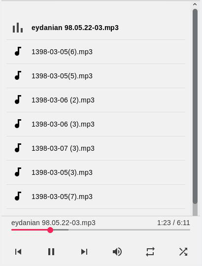

# simple-music-player

Simple music player is a web-based music player with playlist support written in HTML5, CSS3, JS handled by a simple python server. This project is based on @likev's [html5-audio-player](https://github.com/likev/html5-audio-player) work with some improvements such as a python web-server to serve requests along with some new features on front-end. I implemented two different python http servers to handle requests. The first uses python 3's built-in `http.server` module (`server.py`) and the second written in `sanic` a simple 3rd party asynchronous web server (`sanic_server.py`). I highly recommend to use second one but if you can't install this module, you can use `server.py` yet!

Currently the aim of this project is developing a **simple web-based music player for local networks** and it's not optimized for large scale music-sharing usages. 

## 1. Features
- Two different web servers (pure python and sanic)
- Keyboard shorcuts!
- Repeat and shuffle support.
- Self contained (does not need any internet access)

## 2. Requirements
- python 3.x
- `sanic` module. install it by `pip install sanic`. Tested with sanic `19.6.2` on arch linux.
- An updated browser and working speakers!

## 3. How to use
In order to share `/home/user/Music` folder run one of the following commands:

    python3 sanic_server.py /home/user/Music
or

    python3 server.py /home/user/Music

in which `python3` refers to python 3.x version. Now you can open the following address in your browser and enjoy listening to musics!

    127.0.0.1:4444

You can change port number (4444) by editing `.py` files. In order to access music on local network, you should know your local IP address. This script tries to find your local IP address but if it can't, you can find it manually using OS specific commands such as `ipconfig`, `ifconfig`, `ip addr`, etc. or by graphical interface. Suppose your IP address is `192.168.1.106`, to access music on local network, other devices should open this link:

    192.168.1.106:4444

Note that sometimes network administrators define limitations on p2p connections, so if this app doesn't work talk to him!

## 4. Keyboard shortcuts

|  key  |    function    |
|:-----:|:--------------:|
| space |   play/pause   |
|   n   |   next music   |
|   p   | previous music |
	
 